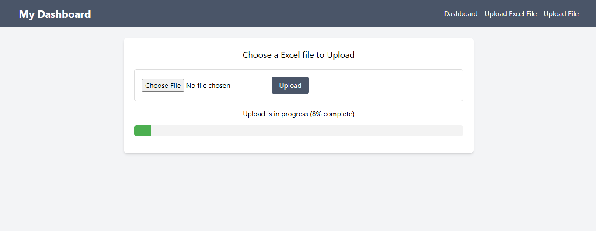
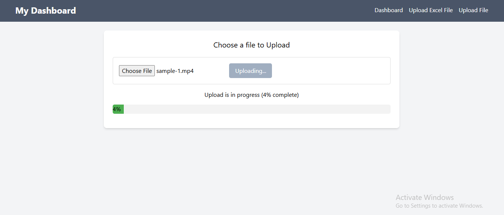

# Laravel ProgressBar with Queue Job Batching

2 types of file uploaders with progress bar

1. Excel Uploader - This is a progress bar for uploading files and can upload millions of record CSV files. Queues and job batching do this. so using multiple small jobs and making them as batches we can get the progress of the execution of each job and display it as a progress bar. Even if refresh, we can track the progress here and in the background, the excel upload will progress. Any type of excel can upload

2. Media uploader - This is a progress bar for uploading files and can upload any type and any size of files. It uses chunk method in front end and using queue and job for this.

This project can use in both as API or normal

for using the project follow the below steps:

1. Clone the repo

2. composer install

3. npm install

4. php artisan migrate

5. php artisan key:generate

## Screenshots - normal Laravel

1. dashboard
   

2. Excel Uploader
   

3. Media Uploader
   
